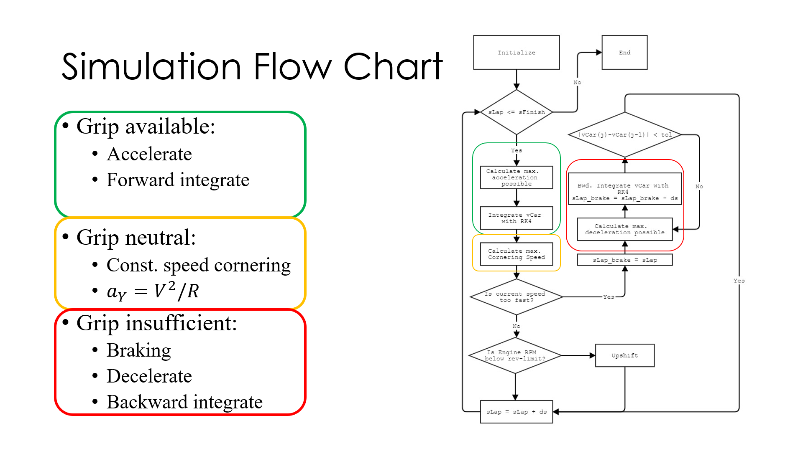
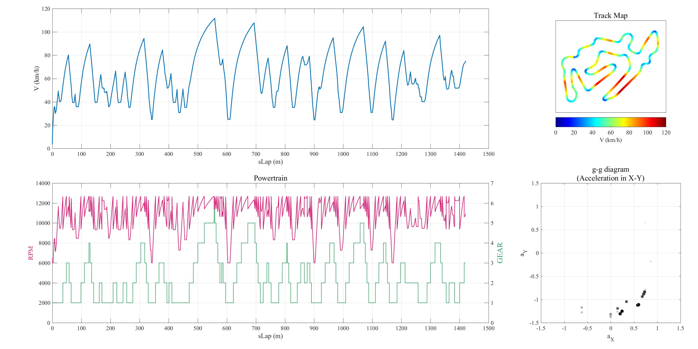

# Advanced Aero Lap-Sim

This is an archive of the AE-419 Flight Mechanics course project. While the vehicle of intest is an FSAE race car, an advanced aerodynamic model is used in this simulation, taking into account the effect of ride height and aerodynamic yaw angle on $C_l$ and $C_d$.

## Why Lap Time Simulation?
* Balance downforce and drag and maximize performance
  * Downforce: cornering and braking performance gain, straigh-line performance penalty
  * Drag (reduction): straightline performance gain

## Why Not Commercial Packages?
* Simplified, commercial package
  * Single value $C_l$, $𝐶_d$
* Aerodynamic performance varies due to:
  * Ride height (ground effect)
  * Side-slip angle (yawing motion due to cornering)

## Advanced Aerodynamic Model
```matlab
% Yaw Effect
c_l_scale = 1 + beta * aero_map.C_L_beta; %C_L_beta < 0
c_d_scale = 1 + beta * aero_map.C_D_beta; %C_D_beta > 0

% Ground Effect
c_L = c_l_scale * griddata(FRH, RRH, C_L, frh, rrh);
c_D = c_d_scale * griddata(FRH, RRH, C_D, frh, rrh);

% frh = F_Z_F / wheel_rate_F;
% rrh = F_Z_R / wheel_rate_R;
```

## Tire & Engine Model

Data Source:
* Tire: https://github.com/CalPolyFSAE/LapSimFE
* Engine: TJU Racing Dyno Test in 2012

## Simulation Flow Chart


## Determining Acceleration/Deceleration


## Formula Student Germany Simulation


YouTube: https://www.youtube.com/watch?v=RXVtqBU9G5s